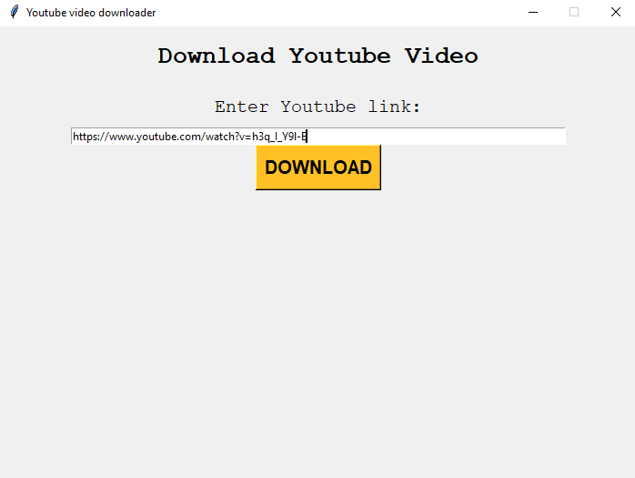
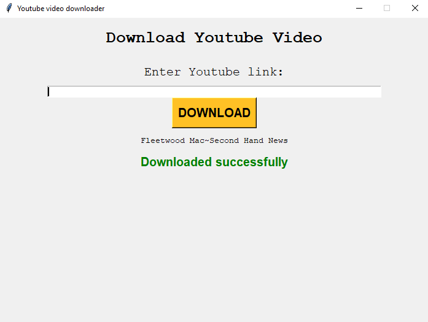

# YouTube-Video-Downloader
> Simple application in Python for downloading videos from YouTube

 

A user needs to enter a youtube link and click on the button to download the video.

## Alati
- Python (Pytube & Tkinter)

